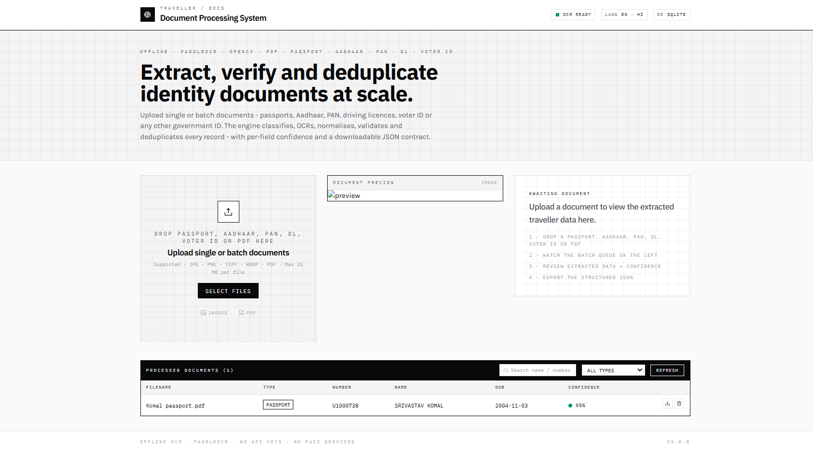
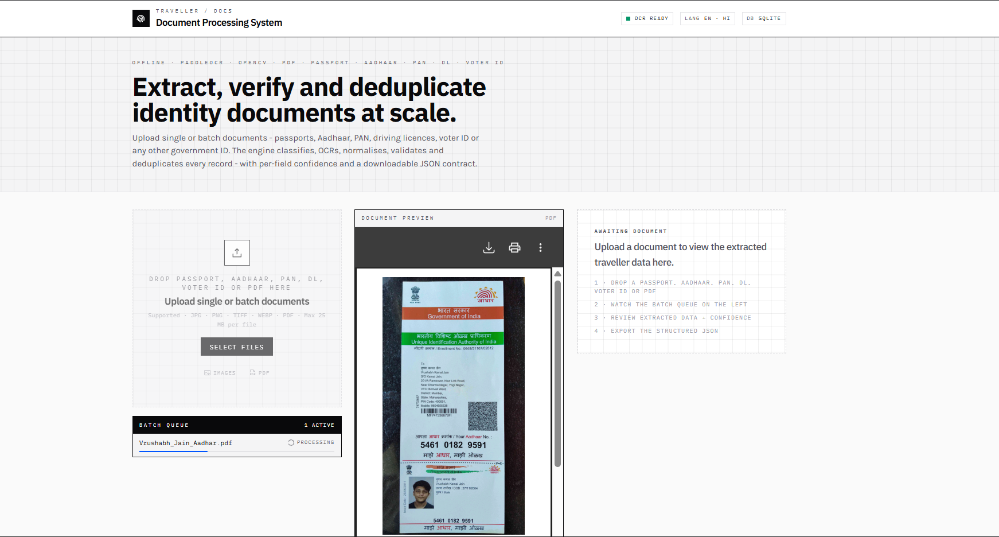

# Traveller Document Processing System

An AI-powered offline OCR system for extracting structured traveller information from Indian identity documents.

This project supports automatic document classification, OCR, information extraction, duplicate detection, PDF processing, and structured JSON output using FastAPI and Next.js.

---

# Features

- OCR-based document extraction
- Passport extraction with ICAO MRZ parsing
- Aadhaar Card support
- PAN Card support
- Driving License support
- Voter ID support
- Batch document upload
- PDF and Image support
- Duplicate document detection
- Automatic document classification
- Structured JSON output
- Confidence scores for extracted fields
- Offline processing (No external OCR APIs)

---

# Tech Stack

## Backend

- Python 3.11
- FastAPI
- PaddleOCR (with RapidOCR ONNX fallback)
- OpenCV
- Pydantic
- SQLAlchemy
- SQLite

## Frontend

- Next.js 14
- React
- Tailwind CSS

---

# Project Structure

```
Doc-OCR-Parser-main
│
├── backend
│   ├── app
│   ├── uploads
│   ├── requirements.txt
│   └── .env.example
│
├── frontend
│
├── docs
│   └── screenshots
│
└── README.md
```

---

# Installation

## Prerequisites

- Python **3.11.x**
- Node.js **18+**
- npm
- Git
- Poppler (Required for PDF processing)

---

# Backend Setup

Clone the repository

```bash
git clone <repository-url>
```

Navigate to backend

```bash
cd backend
```

Create a Python 3.11 virtual environment

Windows

```bash
py -3.11 -m venv .venv
```

Activate it

```powershell
.\.venv\Scripts\Activate.ps1
```

Install dependencies

```bash
pip install -r requirements.txt
```

Create the environment file

```bash
copy .env.example .env
```

Run the backend

```bash
uvicorn app.main:app --reload
```

Backend runs at

```
http://localhost:8000
```

---

# Frontend Setup

Navigate to frontend

```bash
cd frontend
```

Install packages

```bash
npm install
```

Run frontend

```bash
npm run dev
```

Frontend runs at

```
http://localhost:3000
```

---

# Poppler Installation (Required)

PDF support requires Poppler.

### Windows

Download Poppler for Windows.

Extract it to:

```
C:\poppler
```

Add the following to your Windows PATH:

```
C:\poppler\Library\bin
```

Restart the terminal.

Verify installation

```bash
pdfinfo -v
```

If it prints the Poppler version, installation is complete.

---

# Supported Documents

| Document | Supported |
|-----------|-----------|
| Passport | ✅ |
| Aadhaar Card | ✅ |
| PAN Card | ✅ |
| Driving License | ✅ |
| Voter ID | ✅ |

---

# OCR Pipeline

```
Upload

↓

Image Preprocessing

↓

Deskew

↓

CLAHE

↓

Adaptive Threshold

↓

OCR

↓

Document Classification

↓

Document Parser

↓

Validation

↓

Duplicate Detection

↓

Structured JSON
```

---

# Passport Processing

Passport extraction includes:

- ICAO 9303 MRZ parsing
- MRZ validation
- Field-aware normalization
- OCR fallback for non-MRZ fields

---

# API Endpoints

## Upload Document

```
POST /api/documents/upload
```

## Batch Upload

```
POST /api/documents/batch
```

## List Documents

```
GET /api/documents
```

## Get Document

```
GET /api/documents/{id}
```

## Delete Document

```
DELETE /api/documents/{id}
```

---

# Screenshots

## Home Page



## Processing Result



---

# Advantages

- Offline OCR processing
- Supports both PDFs and images
- Automatic document classification
- Batch upload support
- Duplicate detection
- Structured JSON output
- Modular parser architecture
- Easy to extend with new document types

---

# Current Limitations

- SQLite is used instead of PostgreSQL.
- Passport visual-zone (VIZ) fields such as Father/Guardian Name may be inaccurate for some passport layouts because they rely on OCR text positioning.
- OCR accuracy depends on scan quality, lighting, skew, and document resolution.
- CPU-only OCR processing can be slower for multi-page PDFs.
- Batch processing is currently synchronous and can take longer for large files.

---

# Future Improvements

- Docker support
- PostgreSQL database
- Background task queue (Celery/RQ)
- Redis integration
- GPU-accelerated OCR
- Improved passport VIZ extraction using OCR bounding-box relationships
- Automatic image quality assessment
- Multi-language OCR
- OCR confidence visualization
- Unit and integration tests
- CI/CD using GitHub Actions

---

# Notes

- Developed as an AI-powered traveller document processing system.
- Optimized for Indian government identity documents.
- Best results are achieved with high-quality scans (300 DPI or higher).